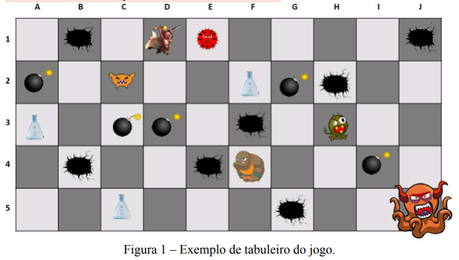

# DUNGEON-FIGHTER

## TO DO

* decidir o tema do jogo
* excluir as bibliotecas redundates dos arquivos da pasta /ui/
* começar a fazer o jogo

## USEFUL

* [BUTTON SOUND EFFECTS](https://www.youtube.com/watch?v=q8ZLBOFQ2g0)
* [SPRITES](https://www.youtube.com/watch?v=wT9uNGzMEM4)

## LIBRARIES

* [javax.swing.SwingUtilities](https://docs.oracle.com/en/java/javase/17/docs/api/java.desktop/javax/swing/SwingUtilities.html)
* [javax.swing.JFrame](https://docs.oracle.com/en/java/javase/22/docs/api/java.desktop/javax/swing/JFrame.html)
* [javax.swing.WindowConstants.EXITONFAILURE](https://docs.oracle.com/en/java/javase/22/docs/api/java.desktop/javax/swing/WindowConstants.html)
* [javax.swing.JFrame.setDefaultCloseOperation()](https://docs.oracle.com/en/java/javase/22/docs/api/java.desktop/javax/swing/JFrame.html#setDefaultCloseOperation(int))
* [javax.swing.JPanel](https://docs.oracle.com/en/java/javase/22/docs/api/java.desktop/javax/swing/JPanel.html)
* [javax.swing.JLabel](https://docs.oracle.com/en/java/javase/22/docs/api/java.desktop/javax/swing/JLabel.html)
* [javax.swing.JButton](https://docs.oracle.com/en/java/javase/22/docs/api/java.desktop/javax/swing/JButton.html)
* [javax.swing.AbstractButton](https://docs.oracle.com/en/java/javase/22/docs/api/java.desktop/javax/swing/AbstractButton.html)
* [javax.swing.AbstractButton.addActionListener(ActionListener l)](https://docs.oracle.com/en/java/javase/22/docs/api/java.desktop/java/awt/Button.html#addActionListener(java.awt.event.ActionListener))
* [javax.swing,Jcomponent](https://docs.oracle.com/en/java/javase/22/docs/api/java.desktop/javax/swing/JComponent.html)
* [javax.swing.JComponent.paintComponent()](https://docs.oracle.com/en/java/javase/22/docs/api/java.desktop/javax/swing/JComponent.html#paintComponent(java.awt.Graphics))
* [javax.swing.JPanel.setBackground()](https://docs.oracle.com/en/java/javase/22/docs/api/java.desktop/javax/swing/JComponent.html#setBackground(java.awt.Color))
* [javax.swing.plaf.basic.BasicToolTopUI](javax.swing.plaf.basic.BasicToolTipUI)
* [javax.swing.plaf.basic.BasicToolTopUI.getPreferredSize()](https://docs.oracle.com/javase/8/docs/api/javax/swing/plaf/basic/BasicToolTipUI.html#getPreferredSize-javax.swing.JComponent-)
* [java.awt.Window](https://docs.oracle.com/en/java/javase/22/docs/api/java.desktop/java/awt/Window.html)
* [java.awt.Window.pack()](https://docs.oracle.com/en/java/javase/22/docs/api/java.desktop/java/awt/Window.html#pack())
* [java.awt.Window.setVisible()](https://docs.oracle.com/en/java/javase/22/docs/api/java.desktop/java/awt/Window.html#setVisible(boolean))
* [java.awt.Container](https://docs.oracle.com/en/java/javase/22/docs/api/java.desktop/java/awt/Container.html)
* [java.awt.Container.add()](https://docs.oracle.com/en/java/javase/22/docs/api/java.desktop/java/awt/Container.html#add(java.awt.Component))
* [java.awt.Container.setLayout()](https://docs.oracle.com/en/java/javase/22/docs/api/java.desktop/java/awt/Container.html#setLayout(java.awt.LayoutManager))
* [java.awt.CardLayout](https://docs.oracle.com/en/java/javase/22/docs/api/java.desktop/java/awt/CardLayout.html)
* [java.awt.CardLayout.show()](https://docs.oracle.com/en/java/javase/22/docs/api/java.desktop/java/awt/CardLayout.html#show(java.awt.Container,java.lang.String))
* [java.awt.Graphics](https://docs.oracle.com/en/java/javase/22/docs/api/java.desktop/java/awt/Graphics.html)
* [java.awt.Image](https://docs.oracle.com/en/java/javase/22/docs/api/java.desktop/java/awt/image/package-summary.html)
* [java.awt.Graphics.drawImage(Image img, int x, int y, int width, int height, ImageObserver observer)](https://docs.oracle.com/en/java/javase/22/docs/api/java.desktop/java/awt/Graphics.html#drawImage(java.awt.Image,int,int,int,int,java.awt.image.ImageObserver))
* [java.awt.Dimension](https://docs.oracle.com/en/java/javase/22/docs/api/java.desktop/java/awt/Dimension.html)
* [java.awt.GridBagLayout](https://docs.oracle.com/en/java/javase/22/docs/api/java.desktop/java/awt/GridBagLayout.html)
* [java.awt.GridBagConstraints](https://docs.oracle.com/en/java/javase/22/docs/api/java.desktop/java/awt/GridBagConstraints.html)
* [GridBagConstraints.RELATIVE](https://docs.oracle.com/en/java/javase/22/docs/api/java.desktop/java/awt/GridBagConstraints.html#RELATIVE)
* [java.awt.Insets(int top, int left, int bottom, int right)](https://docs.oracle.com/en/java/javase/22/docs/api/java.desktop/java/awt/Insets.html)
* [javax.imageio.ImageIO](https://docs.oracle.com/en/java/javase/22/docs/api/java.desktop/javax/imageio/ImageIO.html)
* [javax.imageio.ImageIO.read(File input)](https://docs.oracle.com/en/java/javase/22/docs/api/java.desktop/javax/imageio/ImageIO.html#read(java.io.File))
* [java.io.File](https://docs.oracle.com/en/java/javase/22/docs/api/java.base/java/io/File.html)
* [java.io.IOException](https://docs.oracle.com/en/java/javase/22/docs/api/java.base/java/io/IOException.html)
* [java.io.IOException.printStackTrace()](https://docs.oracle.com/en/java/javase/22/docs/api/java.base/java/lang/Throwable.html#printStackTrace())

## GAME

* 1 jogador

* é possivel
> explorar a masmorra \
> vasculhar suas inumeras salas \
> enfrentar monstros \
> no fim derrotar um chefão

* herois possuem atributos
> ataque \
> defesa \
> saude 

* herois possuem habilidades
> defesa \
> recuperação \
> ataque 

* 3 tipos de herói
> barbaro \
> paladino \
> guerreiro 

1. Quando o jogo começa, o jogador escolhe o seu herói de acordo com um tipo e recebe:
    - X pontos para distribuir entre seus atributos. 
    - Os pontos de vida serão Y + saúde 
2. Cada tipo de herói possui uma habilidade especial que pode ser usada uma vez a cada batalha:
    - Guerreiro: Postura Defensiva - Aumenta sua defesa em 50% durante duas rodadas;
    - Paladino: Recuperação - Recupera 50% dos seus pontos de vida totais;
    - Bárbaro: Golpe furioso - Desfere um ataque que causa 50% a mais de dano.
3. O objetivo do jogo é percorrer um calabouço
    
    

    e enfrentar o monstro no fim dele (que sempre está em uma posição da última linha do
    tabuleiro).

